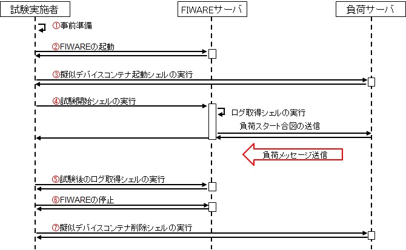

# 負荷検証

構成例


コンポーネント構成


## 環境構築
### FIWAREサーバの構築

|項目|Version|
|:-:|:-:|
|OS|Ubuntu 16.04 LTS|
|docker|18.06.1-ce, build e68fc7a|
|docker-compose|1.22.0, build f46880fe|

#### Dockerのインストール

公式手順に従いインストールを行う
https://docs.docker.com/install/linux/docker-ce/ubuntu/

##### インストール手順

パッケージインデックスを更新

```bash
~$ sudo apt-get update
```

HTTPS経由でリポジトリを使用できるようにするためのパッケージをインストール

```bash
~$ sudo apt-get install \
  apt-transport-https \
  ca-certificates \
  curl \
  software-properties-common
```

```bash
~$ curl -fsSL https://download.docker.com/linux/ubuntu/gpg | sudo apt-key add -
```

Dockerの公式GPGキーを追加

```bash
~$ sudo apt-key fingerprint 0EBFCD88
```

フィンガープリント9DC8 5822 9FC7 DD38 854A E2D8 8D81 803C 0EBF CD88の最後の8文字を検索して、フィンガープリントを持つキーが手元にあることを確認

```bash
~$ sudo add-apt-repository \
 "deb [arch=amd64] https://download.docker.com/linux/ubuntu \
 $(lsb_release -cs) \
 stable"
```

パッケージインデックスを更新

```bash
~$ sudo apt-get update
```

リポジトリで利用可能なバージョンを一覧表示

```bash
~$ apt-cache madison docker-ce
```

特定バージョン(`docker-ce=18.06.1~ce~3-0~ubuntu`)のDockerをインストール

```bash
~$ sudo apt-get install docker-ce=18.06.1~ce~3-0~ubuntu
```

dockerグループを作成
　`groupadd: group 'docker' already exists`と表示されるが問題ない
 
```bash
~$ sudo groupadd docker
groupadd: group 'docker' already exists
```

自分のユーザーをdockerグループに追加

```bash
~$ sudo usermod -aG docker $USER
```

ログアウトし再ログイン後バージョンの確認

```bash
~$ docker --version
Docker version 18.06.1-ce, build e68fc7a
```

#### Docker Composeのインストール

公式手順に従いインストールを行う
https://docs.docker.com/compose/install/#install-compose

##### インストール手順

特定バージョン(1.22.0)のDocker Composeをダウンロード

```bash
~$ sudo curl -L "https://github.com/docker/compose/releases/download/1.22.0/docker-compose-$(uname -s)-$(uname -m)" -o /usr/local/bin/docker-compose
```

実行可能権限をバイナリに適用

```bash
~$ sudo chmod +x /usr/local/bin/docker-compose
```

/usr/binパスにシンボリックリンクの作成

```bash
~$ sudo ln -s /usr/local/bin/docker-compose /usr/bin/docker-compose
```

バージョンの確認

```bash
~$ docker-compose --version
docker-compose version 1.22.0, build f46880fe
```

#### 検証を実施するために必要なパッケージのインストール

- sysstat　(fiware-poc/poc/performance-test/shell/before_logging/host_metrics.shでシステムの状態(CPU,メモリ,ディスクI/Oなど)監視のために使用)
- jq　(fiware-poc/poc/performance-test/shell/after_logging/get_throughput.shでスループットを取得するシェルの中でJSONから値を抽出するために使用)
- mosquitto-clients　(fiware-poc/poc/performance-test/shell/init/start_init.shでMQTTメッセージ送信のために使用)

```bash
~$ sudo apt install sysstat jq mosquitto-clients
```

#### gitのクローン

```bash
~$ cd ~/
~$ git clone https://github.com/oolorg/fiware-poc.git
```

### 負荷サーバの構築

|項目|Version|
|:-:|:-:|
|OS|Ubuntu 16.04 LTS|
|docker|18.06.1-ce, build e68fc7a|

#### Dockerのインストール

[[FIWAREサーバの構築]の[dockerのインストール]](#dockerのインストール)手順に従いdockerのインスールを行う

#### 負荷をかけるために必要なパッケージのインストール

- sysstat　(fiware-poc/poc/performance-test/shell/before_logging/host_metrics.shでシステムの状態(CPU,メモリ,ディスクI/Oなど)監視のために使用)

```bash
~$ sudo apt install sysstat
```

#### gitのクローン

```bash
~$ cd ~/
~$ git clone https://github.com/oolorg/fiware-poc.git
```

#### 疑似デバイス用コンテナイメージのビルド

```bash
~$ cd ~/fiware-poc/pocs/performance-test/dummy_device
~/fiware-poc/pocs/performance-test/dummy_device$ docker build . -t dummy_device
```

---

## 負荷試験実施手順

負荷試験実施シーケンス



### 1.事前準備

#### 負荷実施シェルの編集　【FIWAREサーバ】

`fiware-poc/pocs/performance-test/shell/init/start_init.sh`と`fiware-poc/pocs/performance-test/shell/after_logging/after_log.sh`の

`export TEST_HOME=`にfiware-pocディレクトリの絶対パスを記載する。

(記載例)

```
export TEST_HOME=/home/user098/fiware-poc
```

#### Docker Composeファイルの決定　【作業対象なし】

検証したい内容により以下2ファイルのどちらかを使用するか決定する。

- Cygnusの集計情報が有効な場合
`docker_compose_aggregate_on.yml`

- Cygnusの集計情報が無効な場合
`docker_compose_aggregate_off.yml` 

#### 負荷のシナリオの決定　【作業対象なし】

擬似デバイスコンテナ起動シェルの実行に必要な項目を決定する

負荷のシナリオのイメージ


|項目|説明|算出方法|例|
|:-:|:-:|:-:|:-:|
|**デバイス数**|起動するデバイスの台数|決めた値|100|
|**データ送信間隔**|1デバイスあたりのデータの送信間隔(秒)|決めた値|1|
|**データ送信回数**|1デバイスあたりのデータ送信回数|(デバイス起動時間＋測定時間＋ランニング時間×2)/データ送信間隔|87400|
|**デバイス起動合計時間**|全てのデバイスが起動するのにかける時間(秒)|デバイス数×デバイス起動間隔|400|
|**送信データタイプ**|送信データの内容([string] or [number])|決めた値|string|
|デバイス起動間隔|1デバイスあたりの起動間隔(秒)|決めた値|4|
|ランニング時間|負荷が定常状態にするためのランニング時間(秒)|決めた値|300|
|測定時間|試験データの対象とする測定時間(秒)|決めた値|86400|

#### subscriptionファイルの決定　【作業対象なし】

検証したい内容により以下2ファイルのどちらかを使用するか決定する。

- Cometに全ての属性値(messagesとTimeInstant)を蓄積する場合
`messages_timeinstant`

- Cometに特定の属性値(messages)のみ蓄積する場合
`messages` 


### 2.Docker Composeの起動　【FIWAREサーバ】

事前準備で決定した項目に従い、下記コマンドでFIWAREサーバを起動する

> `{Docker Compose ファイル名}` は試験内容によって書き換える。

```bash
$ cd ~/fiware-poc/pocs/performance-test/platformedit
~/fiware-poc/pocs/performance-test/platformedit$ # docker-compose -f {Docker Compose ファイル名} up -d
~/fiware-poc/pocs/performance-test/platformedit$   docker-compose -f docker_compose_aggregate_on.yml up -d
Creating network "platformedit_default" with the default driver
Creating mongodb-comet-demo ... done
Creating mongodb-orion-demo ... done
Creating mosquitto-demo     ... done
Creating mongodb-idas-demo  ... done
Creating orion-demo         ... done
Creating idas-demo          ... done
Creating cygnus-demo        ... done
Creating comet-demo         ... done
```

各コンポーネントの起動確認を実施　(stateがUpになっている)

> `{Docker Compose ファイル名}` は試験内容によって書き換える。

```bash
~/fiware-poc/pocs/performance-test/platformedit$ # docker-compose -f {Docker Compose ファイル名} ps
~/fiware-poc/pocs/performance-test/platformedit$   docker-compose -f docker_compose_aggregate_on.yml ps
       Name                     Command               State                                    Ports
--------------------------------------------------------------------------------------------------------------------------------------
comet-demo           /bin/sh -c bin/sth               Up      0.0.0.0:8666->8666/tcp
cygnus-demo          /cygnus-entrypoint.sh            Up      0.0.0.0:41414->41414/tcp, 0.0.0.0:5050->5050/tcp, 0.0.0.0:5080->5080/tcp
idas-demo            /bin/sh -c bin/iotagent-js ...   Up      0.0.0.0:4041->4041/tcp
mongodb-comet-demo   docker-entrypoint.sh --noj ...   Up      27017/tcp
mongodb-idas-demo    docker-entrypoint.sh --noj ...   Up      27017/tcp
mongodb-orion-demo   docker-entrypoint.sh --noj ...   Up      27017/tcp
mosquitto-demo       /bin/sh -c /bin/startMosqu ...   Up      0.0.0.0:1883->1883/tcp
orion-demo           /usr/bin/contextBroker -fg ...   Up      0.0.0.0:1026->1026/tcp
```

### 3.擬似デバイスコンテナ起動シェルの実行　【負荷サーバ】

事前準備で決定した項目に従い、下記コマンドで擬似デバイスコンテナ起動シェルを実行する

> `{FIWAREサーバIP}`、` {デバイス数}`、`{データ送信間隔(秒)}`、`{データ送信回数}`、`{デバイス起動合計時間(秒)}`、`{送信データタイプ}`は試験内容によって書き換える。

```bash
~$ cd ~/fiware-poc/pocs/performance-test/dummy_device
~/fiware-poc/pocs/performance-test/dummy_device$ # ./run_containers.sh {FIWAREサーバIP} {デバイス数} {データ送信間隔(秒)} {データ送信回数} {デバイス起動合計時間(秒)} {送信データタイプ}
~/fiware-poc/pocs/performance-test/dummy_device$   ./run_containers.sh 192.168.28.50 10 1 10 10 string
```

### 4.試験開始シェルの実行　【FIWAREサーバ】

事前準備で決定した項目に従い、下記コマンドで試験開始シェルを実行する

> `{デバイス数}`、`{subscriptionファイル名}` は試験内容によって書き換える。

```bash
~$ cd ~/fiware-poc/pocs/performance-test/shell/init
~/fiware-poc/pocs/performance-test/shell/init$ # ./start_init.sh {デバイス数} {subscriptionファイル名}
~/fiware-poc/pocs/performance-test/shell/init$   ./start_init.sh 10 messages_timeinstant
Creating service.
{}Created service.
Creating devices
{}{}{}{}{}{}{}{}{}{}Created devices
Creating subscription.
Created subscription.
```

【負荷サーバ】で試験終了判定シェルを実行し試験が終了したことを確認する

> `doing`は試験中　 `done`は試験終了

```bash
~$ cd ~/fiware-poc/pocs/performance-test/dummy_device
~/fiware-poc/pocs/performance-test/dummy_device$ ./judge_test_end.sh
doing

~/fiware-poc/pocs/performance-test/dummy_device$ ./judge_test_end.sh
done
```


### 5.試験後のログ取得シェルの実行　【FIWAREサーバ】

事前準備で決定した項目に従い、下記コマンドで試験後のログ取得シェルを実行する

> `{デバイス数}` は試験内容によって書き換える。

```bash
~$ cd ~/fiware-poc/pocs/performance-test/shell/after_logging
~/fiware-poc/pocs/performance-test/shell/after_logging$ # ./after_log.sh {デバイス数}
~/fiware-poc/pocs/performance-test/shell/after_logging$   ./after_log.sh 10
OK
```

### 6.Docker Composeの停止　【FIWAREサーバ】

事前準備で決定した項目に従い、下記コマンドでFIWAREサーバを停止する

> `{Docker Compose ファイル名}` は試験内容によって書き換える。

```bash
~$ cd ~/fiware-poc/pocs/performance-test/platformedit
~/fiware-poc/pocs/performance-test/platformedit$ # docker-compose -f {Docker Compose ファイル名} down
~/fiware-poc/pocs/performance-test/platformedit$   docker-compose -f docker_compose_aggregate_on.yml down
Stopping cygnus-demo        ... done
Stopping comet-demo         ... done
Stopping idas-demo          ... done
Stopping orion-demo         ... done
Stopping mongodb-idas-demo  ... done
Stopping mongodb-comet-demo ... done
Stopping mosquitto-demo     ... done
Stopping mongodb-orion-demo ... done
Removing cygnus-demo        ... done
Removing comet-demo         ... done
Removing idas-demo          ... done
Removing orion-demo         ... done
Removing mongodb-idas-demo  ... done
Removing mongodb-comet-demo ... done
Removing mosquitto-demo     ... done
Removing mongodb-orion-demo ... done
Removing network platformedit_default
```

### 7.擬似デバイスコンテナの削除シェルの実行　【負荷サーバ】

下記コマンドで、試験後のログ取得シェルを実行する

```bash
~$ cd ~/fiware-poc/pocs/performance-test/dummy_device
~/fiware-poc/pocs/performance-test/dummy_device$ ./del_containers.sh
Remove ec577dec50c7
Remove 2780f58e8492
Remove 0e6a15555665
Remove d734c31ae125
Remove ad10c3858891
Remove 0a792aea6b23
Remove 7c3f4e6b1e86
Remove 94f217411141
Remove 7e236c26a9a6
Remove 7cff629f68d4
0
```
