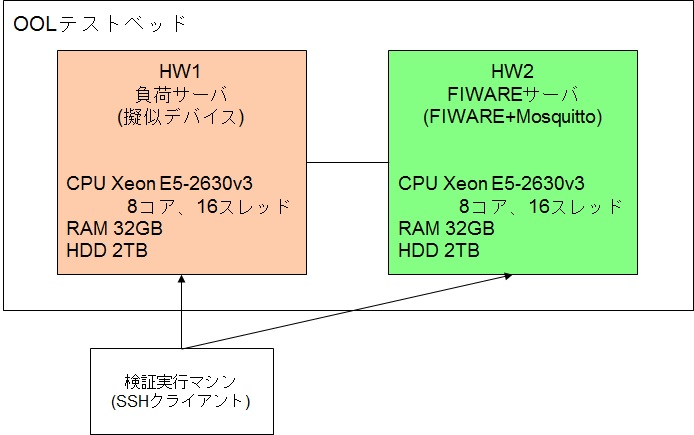

# 負荷検証

構成例



コンポーネント構成


## 環境構築
### FIWAREサーバの構築

|項目|Version|
|:-:|:-:|
|OS|Ubuntu 16.04 LTS|
|docker|18.06.1-ce, build e68fc7a|
|docker-compose|1.22.0, build f46880fe|

#### Dockerのインストール

公式手順に従いインストールを行う
https://docs.docker.com/install/linux/docker-ce/ubuntu/

##### インストール手順

パッケージインデックスを更新

```
$ sudo apt-get update
```

HTTPS経由でリポジトリを使用できるようにするためのパッケージをインストール

```
$ sudo apt-get install \
  apt-transport-https \
  ca-certificates \
  curl \
  software-properties-common
```

```
$ curl -fsSL https://download.docker.com/linux/ubuntu/gpg | sudo apt-key add -
```

Dockerの公式GPGキーを追加

```
$ sudo apt-key fingerprint 0EBFCD88
```

フィンガープリント9DC8 5822 9FC7 DD38 854A E2D8 8D81 803C 0EBF CD88の最後の8文字を検索して、フィンガープリントを持つキーが手元にあることを確認

```
$ sudo add-apt-repository \
 "deb [arch=amd64] https://download.docker.com/linux/ubuntu \
 $(lsb_release -cs) \
 stable"
```

パッケージインデックスを更新

```
$ sudo apt-get update
```

リポジトリで利用可能なバージョンを一覧表示

```
$ apt-cache madison docker-ce
```

特定バージョン(`docker-ce=18.06.1~ce~3-0~ubuntu`)のDockerをインストール

```
$ sudo apt-get install docker-ce=18.06.1~ce~3-0~ubuntu
```

dockerグループを作成

```
$ sudo groupadd docker
groupadd: group 'docker' already exists
```

自分のユーザーをdockerグループに追加

```
$ sudo usermod -aG docker $USER
```

ログアウトし再ログイン後バージョンの確認

```
$ docker --version
Docker version 18.06.1-ce, build e68fc7a
```

#### Docker Composeのインストール

公式手順に従いインストールを行う
https://docs.docker.com/compose/install/#install-compose

##### インストール手順

特定バージョン(1.22.0)のDocker Composeをダウンロード

```
$ sudo curl -L "https://github.com/docker/compose/releases/download/1.22.0/docker-compose-$(uname -s)-$(uname -m)" -o /usr/local/bin/docker-compose
```

実行可能権限をバイナリに適用

```
$ sudo chmod +x /usr/local/bin/docker-compose
```

/usr/binパスにシンボリックリンクの作成

```
$ sudo ln -s /usr/local/bin/docker-compose /usr/bin/docker-compose
```

バージョンの確認

```
$ docker-compose --version
docker-compose version 1.22.0, build f46880fe
```

#### 検証を実施するために必要なパッケージのインストール

- sysstat　(システムの状態(CPU,メモリ,ディスクI/Oなど)監視のため)
- jq　(JSON形式のデータの整形・抽出のため)
- mosquitto-clients　(MQTTメッセージ送信のため)

```
$ sudo apt install sysstat jq mosquitto-clients
```

#### gitのクローン

```
$ git clone https://github.com/oolorg/fiware-poc.git
```

### 負荷サーバの構築

|項目|Version|
|:-:|:-:|
|OS|Ubuntu 16.04 LTS|
|docker|18.06.1-ce, build e68fc7a|

#### Dockerのインストール

[[FIWAREサーバの構築]の[dockerのインストール]](#dockerのインストール)手順に従いdockerのインスールを行う

#### 負荷をかけるために必要なパッケージのインストール

- sysstat　(システムの状態(CPU,メモリ,ディスクI/Oなど)監視のため)
- jq　(JSON形式のデータの整形・抽出のため)
- bc　(複雑な計算実施のため)

```
$ sudo apt install sysstat jq bc
```

#### gitのクローン

```
$ git clone https://github.com/oolorg/fiware-poc.git
```

#### 疑似デバイス用コンテナイメージのビルド

```
$ cd fiware-poc/pocs/performance-test/dummy_device
$ docker build . -t dummy_device
```

---

## 負荷試験実施手順

負荷試験実施シーケンス


