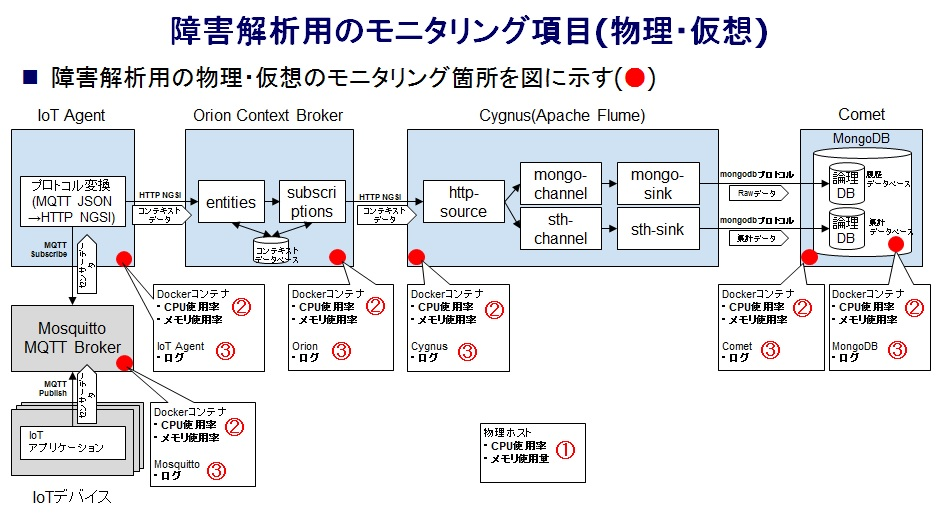
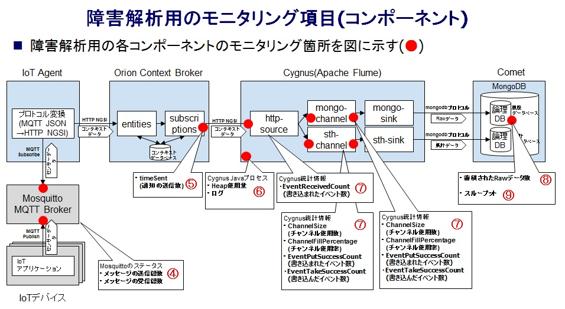

# 目次
-  [負荷検証](#負荷検証)
    -  [環境構築](#環境構築)
        -  [FIWAREサーバの構築](#FIWAREサーバの構築)
        -  [負荷サーバの構築](#負荷サーバの構築)
    -  [負荷試験実施手順](#負荷試験実施手順)
        -  [1.事前準備](#1事前準備)
        -  [2.FIWAREの起動　【FIWAREサーバで作業を行う】](#2FIWAREの起動FIWAREサーバで作業を行う)
        -  [3.擬似デバイスコンテナ起動シェルの実行　【負荷サーバで作業を行う】](#3擬似デバイスコンテナ起動シェルの実行負荷サーバで作業を行う)
        -  [4.試験開始シェルの実行　【FIWAREサーバで作業を行う】](#4試験開始シェルの実行FIWAREサーバで作業を行う)
        -  [5.試験後のログ取得シェルの実行　【FIWAREサーバで作業を行う】](#5試験後のログ取得シェルの実行FIWAREサーバで作業を行う)
        -  [6.FIWAREの停止　【FIWAREサーバで作業を行う】](#6FIWAREの停止FIWAREサーバで作業を行う)
        -  [7.擬似デバイスコンテナの削除シェルの実行　【負荷サーバで作業を行う】](#7擬似デバイスコンテナの削除シェルの実行負荷サーバで作業を行う)
    - [ログ取得シェルの概要とログの見方](#ログ取得シェルの概要とログの見方)
        -  [① 物理ホストのリソース](#-物理ホストのリソース)
        -  [② Dockerコンテナのリソース](#-dockerコンテナのリソース)
        -  [③ Dockerコンテナのログ](#-dockerコンテナのログ)
        -  [④ Mosquittoのメッセージの送受信数](#-mosquittoのメッセージの送受信数)
        -  [⑤ Orionの通知の送信数](#-orionの通知の送信数)
        -  [⑥ CygnusのJavaのプロセス](#-cygnusのjavaのプロセス)
        -  [⑦ Cygnusの統計情報](#-cygnusの統計情報)
        -  [⑧ Cometに蓄積されたRawデータ数](#-cometに蓄積されたrawデータ数)
        -  [⑨ スループット](#-スループット)

# 負荷検証

構成例


コンポーネント構成


## 環境構築
### FIWAREサーバの構築

|項目|Version|
|:-:|:-:|
|OS|Ubuntu 16.04 LTS|
|docker|18.06.1-ce, build e68fc7a|
|docker-compose|1.22.0, build f46880fe|

#### Dockerのインストール

公式手順に従いインストールを行う
https://docs.docker.com/install/linux/docker-ce/ubuntu/

##### インストール手順

パッケージインデックスを更新

```bash
~$ sudo apt-get update
```

HTTPS経由でリポジトリを使用できるようにするためのパッケージをインストール

```bash
~$ sudo apt-get install \
  apt-transport-https \
  ca-certificates \
  curl \
  software-properties-common
```

```bash
~$ curl -fsSL https://download.docker.com/linux/ubuntu/gpg | sudo apt-key add -
```

Dockerの公式GPGキーを追加

```bash
~$ sudo apt-key fingerprint 0EBFCD88
```

フィンガープリント9DC8 5822 9FC7 DD38 854A E2D8 8D81 803C 0EBF CD88の最後の8文字を検索して、フィンガープリントを持つキーが手元にあることを確認

```bash
~$ sudo add-apt-repository \
 "deb [arch=amd64] https://download.docker.com/linux/ubuntu \
 $(lsb_release -cs) \
 stable"
```

パッケージインデックスを更新

```bash
~$ sudo apt-get update
```

リポジトリで利用可能なバージョンを一覧表示

```bash
~$ apt-cache madison docker-ce
```

特定バージョン(`docker-ce=18.06.1~ce~3-0~ubuntu`)のDockerをインストール

```bash
~$ sudo apt-get install docker-ce=18.06.1~ce~3-0~ubuntu
```

dockerグループを作成
　`groupadd: group 'docker' already exists`と表示されるが問題ない
 
```bash
~$ sudo groupadd docker
groupadd: group 'docker' already exists
```

自分のユーザーをdockerグループに追加

```bash
~$ sudo usermod -aG docker $USER
```

ログアウトし再ログイン後バージョンの確認

```bash
~$ docker --version
Docker version 18.06.1-ce, build e68fc7a
```

#### Docker Composeのインストール

公式手順に従いインストールを行う
https://docs.docker.com/compose/install/#install-compose

##### インストール手順

特定バージョン(1.22.0)のDocker Composeをダウンロード

```bash
~$ sudo curl -L "https://github.com/docker/compose/releases/download/1.22.0/docker-compose-$(uname -s)-$(uname -m)" -o /usr/local/bin/docker-compose
```

実行可能権限をバイナリに適用

```bash
~$ sudo chmod +x /usr/local/bin/docker-compose
```

/usr/binパスにシンボリックリンクの作成

```bash
~$ sudo ln -s /usr/local/bin/docker-compose /usr/bin/docker-compose
```

バージョンの確認

```bash
~$ docker-compose --version
docker-compose version 1.22.0, build f46880fe
```

#### 検証を実施するために必要なパッケージのインストール

- sysstat　([fiware-poc/poc/performance-test/shell/before_logging/get_host_metrics.sh](https://github.com/oolorg/fiware-poc/blob/master/pocs/performance-test/shell/before_logging/get_host_metrics.sh)でシステムの状態(CPU,メモリ,ディスクI/Oなど)監視のために使用)
- jq　([fiware-poc/poc/performance-test/shell/after_logging/get_throughput.sh](https://github.com/oolorg/fiware-poc/blob/master/pocs/performance-test/shell/after_logging/get_throughput.sh)、[fiware-poc/poc/performance-test/shell/before_logging/get_cygnus_metrics.sh](https://github.com/oolorg/fiware-poc/blob/master/pocs/performance-test/shell/before_logging/get_cygnus_metrics.sh)でJSONから値を抽出するために使用)
- mosquitto-clients　([fiware-poc/poc/performance-test/shell/init/start_init.sh](https://github.com/oolorg/fiware-poc/blob/master/pocs/performance-test/shell/init/start_init.sh)でMQTTメッセージ送信のために使用)

```bash
~$ sudo apt install sysstat jq mosquitto-clients
```

#### gitのクローン

```bash
~$ cd ~/
~$ git clone https://github.com/oolorg/fiware-poc.git
```

### 負荷サーバの構築

|項目|Version|
|:-:|:-:|
|OS|Ubuntu 16.04 LTS|
|docker|18.06.1-ce, build e68fc7a|

#### Dockerのインストール

[[FIWAREサーバの構築]の[dockerのインストール]](#dockerのインストール)手順に従いdockerのインスールを行う

#### 負荷をかけるために必要なパッケージのインストール

- sysstat　([fiware-poc/poc/performance-test/shell/before_logging/get_host_metrics.sh](https://github.com/oolorg/fiware-poc/blob/master/pocs/performance-test/shell/before_logging/get_host_metrics.sh)でシステムの状態(CPU,メモリ,ディスクI/Oなど)監視のために使用)

```bash
~$ sudo apt install sysstat
```

#### gitのクローン

```bash
~$ cd ~/
~$ git clone https://github.com/oolorg/fiware-poc.git
```

#### 疑似デバイス用コンテナイメージのビルド

```bash
~$ cd ~/fiware-poc/pocs/performance-test/dummy_device
~/fiware-poc/pocs/performance-test/dummy_device$ docker build . -t dummy_device
```

---

## 負荷試験実施手順

負荷試験実施シーケンス


### 1.事前準備

#### 試験に使用するシェルの編集　【FIWAREサーバで作業を行う】

試験で使用するシェルに`fiware-poc`ディレクトリのパスを記載する必要があるため、
[fiware-poc/poc/performance-test/shell/init/start_init.sh](https://github.com/oolorg/fiware-poc/blob/master/pocs/performance-test/shell/init/start_init.sh)と[fiware-poc/pocs/performance-test/shell/after_logging/after_log.sh](https://github.com/oolorg/fiware-poc/blob/master/pocs/performance-test/shell/after_logging/after_log.sh)の
`export TEST_HOME=`にfiware-pocディレクトリの絶対パスを記載する。

(記載例)

```
export TEST_HOME=/home/user098/fiware-poc
```

#### Docker Composeファイルの決定　【作業対象なし】

検証したい内容により以下2ファイルのどちらかを使用するか決定する。

- `docker_compose_aggregate_on.yml`
    - Cygnusの集計情報が有効な場合

- `docker_compose_aggregate_off.yml` 
    - Cygnusの集計情報が無効な場合

#### 負荷の条件の決定　【作業対象なし】

擬似デバイスコンテナ起動シェルの実行に必要な項目を決定する

負荷の条件のイメージ(※1)(※2)


|項目|説明|例(100msg/sで24時間の試験を行う例)|
|:-:|:-:|:-:|
|FIWAREサーバIP|負荷をかける対象となるFIWAREサーバのIP|192.168.28.50|
|デバイス数|起動するデバイスの台数|100|
|データ送信間隔(※3)|1デバイスあたりのデータの送信間隔(秒)|1|
|測定時間|負荷が定常状態になってからの測定時間(秒) |87000|
|データ送信開始間隔|各デバイスがデータを送信開始する間隔(秒)|4|
|送信データタイプ|送信データの内容([string] or [number])|string|

(※1)スループットの増加時間と減少時間はデータ送信開始間隔とデバイス数で決まるため、個別の設定は未対応

(※2)定常スループットに達するまでの負荷の増え方を設定できるように、各擬似デバイスがデータの送信を開始する間隔の指定をできるようにしている。(データ送信開始間隔を0にすることで、負荷を急激に増加させることが可能)

(※3)データ送信間隔は1秒未満は未対応

#### subscription内容の決定　【作業対象なし】

検証したい内容により以下のどちらかを使用するか決定する。

- `messages_timeinstant` 
    - Cometに全ての属性値(messagesとTimeInstant)を蓄積する場合

- `messages` 
    - Cometに特定の属性値(messages)のみ蓄積する場合

#### 参考 DockerComposeファイル・subscription内容・送信データタイプの選択例

DockerComposeファイル・subscription内容・送信データタイプの選択例として測定実績のある3パターンを記載する

|要件|DockerComposeファイル|subscription内容|送信データタイプ|
|:-:|:-:|:-:|:-:|
|集計有効、文字列|docker_compose_aggregate_on.yml|messages_timeinstant|string|
|集計有効、数値のみ|docker_compose_aggregate_on.yml|messages|number|
|集計無効、文字列|docker_compose_aggregate_off.yml|messages_timeinstant|string|


### 2.FIWAREの起動　【FIWAREサーバで作業を行う】

[事前準備で決定した項目](#Docker-Composeファイルの決定作業対象なし)に従い、下記コマンドでFIWAREを起動する

> `{Docker Compose ファイル}` は試験内容によって書き換える。

```bash
$ cd ~/fiware-poc/pocs/performance-test/platform
~/fiware-poc/pocs/performance-test/platform$ # docker-compose -f {Docker Compose ファイル} up -d
~/fiware-poc/pocs/performance-test/platform$   docker-compose -f docker_compose_aggregate_on.yml up -d
Creating network "platform_default" with the default driver
Creating mongodb-comet-demo ... done
Creating mongodb-orion-demo ... done
Creating mosquitto-demo     ... done
Creating mongodb-idas-demo  ... done
Creating orion-demo         ... done
Creating idas-demo          ... done
Creating cygnus-demo        ... done
Creating comet-demo         ... done
```

各コンポーネントの起動確認を実施　(stateがUpになっている)

> `{Docker Compose ファイル}` は試験内容によって書き換える。

```bash
~/fiware-poc/pocs/performance-test/platform$ # docker-compose -f {Docker Compose ファイル} ps
~/fiware-poc/pocs/performance-test/platform$   docker-compose -f docker_compose_aggregate_on.yml ps
       Name                     Command               State                                    Ports
--------------------------------------------------------------------------------------------------------------------------------------
comet-demo           /bin/sh -c bin/sth               Up      0.0.0.0:8666->8666/tcp
cygnus-demo          /cygnus-entrypoint.sh            Up      0.0.0.0:41414->41414/tcp, 0.0.0.0:5050->5050/tcp, 0.0.0.0:5080->5080/tcp
idas-demo            /bin/sh -c bin/iotagent-js ...   Up      0.0.0.0:4041->4041/tcp
mongodb-comet-demo   docker-entrypoint.sh --noj ...   Up      27017/tcp
mongodb-idas-demo    docker-entrypoint.sh --noj ...   Up      27017/tcp
mongodb-orion-demo   docker-entrypoint.sh --noj ...   Up      27017/tcp
mosquitto-demo       /bin/sh -c /bin/startMosqu ...   Up      0.0.0.0:1883->1883/tcp
orion-demo           /usr/bin/contextBroker -fg ...   Up      0.0.0.0:1026->1026/tcp
```

### 3.擬似デバイスコンテナ起動シェルの実行　【負荷サーバで作業を行う】

[事前準備で決定した項目](#負荷の条件の決定作業対象なし)に従い、下記コマンドで擬似デバイスコンテナ起動シェルを実行する

> `{FIWAREサーバIP}`、` {デバイス数}`、`{データ送信間隔(秒)}`、`{測定時間(秒)}`、`{データ送信開始間隔(秒)}`、`{送信データタイプ}`は試験内容によって書き換える。

```bash
~/fiware-poc/pocs/performance-test/dummy_device$ # ./run_containers.sh {FIWAREサーバIP} {デバイス数} {データ送信間隔(秒)} {測定時間(秒)} {データ送信開始間隔(秒)} {送信データタイプ}
~/fiware-poc/pocs/performance-test/dummy_device$ 　./run_containers.sh 192.168.28.50 100 1 87000 4 string

Number of containers
100

Expected finish time
03/13 16:27:48

Numebr of messages sent by one device
87400

Number of messages sent by all devices
8740000
```

### 4.試験開始シェルの実行　【FIWAREサーバで作業を行う】

[事前準備で決定した項目](#subscription内容の決定作業対象なし)に従い、下記コマンドで試験開始シェルを実行する

> `{デバイス数}`、`{subscription内容}` は試験内容によって書き換える。

```bash
~$ cd ~/fiware-poc/pocs/performance-test/shell/init
~/fiware-poc/pocs/performance-test/shell/init$ #./start_init.sh {デバイス数} {subscription内容}
~/fiware-poc/pocs/performance-test/shell/init$  ./start_init.sh 100 messages_timeinstant
Creating service.
{}Created service.
Creating devices
{}{}{}{}{}{}{}{}{}{}{}{}{}{}{}{}{}{}{}{}{}{}{}{}{}{}{}{}{}{}{}{}{}{}{}{}{}{}{}{}{}{}{}{}{}{}{}{}{}{}{}{}{}{}{}{}{}{}{}{}{}{}{}{}{}{}{}{}{}{}{}{}{}{}{}{}{}{}{}{}{}{}{}{}{}{}{}{}{}{}{}{}{}{}{}{}{}{}{}{}Created devices
Creating subscription.
Created subscription.
```

【負荷サーバ】で試験終了判定シェルを実行し試験が終了したことを確認する

> `doing`は試験中　 `done`は試験終了

```bash
~$ cd ~/fiware-poc/pocs/performance-test/dummy_device
~/fiware-poc/pocs/performance-test/dummy_device$ ./judge_test_end.sh
doing

~/fiware-poc/pocs/performance-test/dummy_device$ ./judge_test_end.sh
done
```

### 5.試験後のログ取得シェルの実行　【FIWAREサーバで作業を行う】

[事前準備で決定した項目](#負荷のシナリオの決定作業対象なし)に従い、下記コマンドで試験後のログ取得シェルを実行する

> `{デバイス数}` は試験内容によって書き換える。

```bash
~$ cd ~/fiware-poc/pocs/performance-test/shell/after_logging
~/fiware-poc/pocs/performance-test/shell/after_logging$ # ./after_log.sh {デバイス数}
~/fiware-poc/pocs/performance-test/shell/after_logging$   ./after_log.sh 100
Not OutOfMemoryError
```

### 6.FIWAREの停止　【FIWAREサーバで作業を行う】

[事前準備で決定した項目](#Docker-Composeファイルの決定作業対象なし)に従い、下記コマンドでFIWAREを停止する

> `{Docker Compose ファイル名}` は試験内容によって書き換える。

```bash
~$ cd ~/fiware-poc/pocs/performance-test/platform
~/fiware-poc/pocs/performance-test/platform$ # docker-compose -f {Docker Compose ファイル名} down
~/fiware-poc/pocs/performance-test/platform$   docker-compose -f docker_compose_aggregate_on.yml down
Stopping cygnus-demo        ... done
Stopping comet-demo         ... done
Stopping idas-demo          ... done
Stopping orion-demo         ... done
Stopping mongodb-idas-demo  ... done
Stopping mongodb-comet-demo ... done
Stopping mosquitto-demo     ... done
Stopping mongodb-orion-demo ... done
Removing cygnus-demo        ... done
Removing comet-demo         ... done
Removing idas-demo          ... done
Removing orion-demo         ... done
Removing mongodb-idas-demo  ... done
Removing mongodb-comet-demo ... done
Removing mosquitto-demo     ... done
Removing mongodb-orion-demo ... done
Removing network platform_default
```

### 7.擬似デバイスコンテナの削除シェルの実行　【負荷サーバで作業を行う】

下記コマンドで、試験後のログ取得シェルを実行する

```bash
~$ cd ~/fiware-poc/pocs/performance-test/dummy_device
~/fiware-poc/pocs/performance-test/dummy_device$ ./del_containers.sh
deleted
```

---

## ログ取得シェルの概要とログの見方

障害解析用の物理・仮想のモニタリング箇所



障害解析用のコンポーネントのモニタリング箇所



### ① 物理ホストのリソース

#### ログ取得シェルの概要

|ログ取得シェル|シェルの説明|引数|実施タイミング|ログファイル名|
|:-:|:-:|:-:|:-:|:-:|
|[get_host_metrics.sh](https://github.com/oolorg/fiware-poc/blob/master/pocs/performance-test/shell/before_logging/get_host_metrics.sh)|物理マシンのリソース(CPU、メモリ)使用率を取得するために、sarコマンドを実行する|データを取得したい間隔(秒)|負荷をかける前|{ホスト名}.sardata|

#### ログの見方

##### CPU使用率

事前作業

　バイナリデータである`{ホスト名}.sardata`から取得したい項目ごとのログを取得するために下記コマンドを実行する

　`sadf -T -d -- -u 1 {ホスト名}.sardata | tr ";" , > sar-cpu.log`
 
CPU使用率の算出

　`100%`-`%idle`(CPUがアイドル状態の割合)で算出

実際のログの例

```bash
~/fiware-poc/pocs/performance-test/log$ cat sar-cpu.log
# hostname,interval,timestamp,CPU,%user,%nice,%system,%iowait,%steal,%idle
compute-c12,1,2019-03-11 07:04:56,-1,1.56,0.00,0.25,0.00,0.00,98.19
compute-c12,1,2019-03-11 07:04:57,-1,0.53,0.00,0.28,0.00,0.00,99.19
```

##### メモリ使用率

事前作業

　バイナリデータである`{ホスト名}.sardata`から取得したい項目ごとのログを取得するために下記コマンドを実行する

　`sadf -T -d -- -r 1 {ホスト名}.sardata | tr ";" , > sar-mem.log`

メモリ使用率の算出

　(`kbmemused`(メモリ使用量(kb))-`kbbuffers`(バッファ使用量(kb))-`kbcached`(キャッシュ使用量(kb)))/`32836772`(メモリ量(kb))*`100`で算出

実際のログの例

```bash
~/fiware-poc/pocs/performance-test/log$ cat sar-mem.log
# hostname,interval,timestamp,kbmemfree,kbmemused,%memused,kbbuffers,kbcached,kbcommit,%commit,kbactive,kbinact,kbdirty
compute-c12,1,2019-03-11 07:04:56,27517604,5376424,16.34,431764,3646704,3859780,9.35,2118212,2435512,172
compute-c12,1,2019-03-11 07:04:57,27522812,5371216,16.33,431764,3646736,3634276,8.80,2111284,2435536,208
```

### ② Dockerコンテナのリソース

#### ログ取得シェルの概要

|ログ取得シェル|シェルの説明|引数|実施タイミング|ログファイル名|
|:-:|:-:|:-:|:-:|:-:|
|[get_fiware_docker_stats.sh](https://github.com/oolorg/fiware-poc/blob/master/pocs/performance-test/shell/before_logging/get_fiware_docker_stats.sh)|Dockerコンテナのリソース使用状況を取得するために、docker statsコマンドを繰り返し実行する|なし|負荷をかける前|fiware_docker_stats.log|

#### ログの見方

##### CPU使用率

　`CPU %`の値を参照する

##### メモリ使用率

　`MEM %`の値を参照する

実際のログの例

```bash
cat fiware_docker_stats.log
2019/03/11 07:04:55.076224306
CONTAINER ID        NAME                 CPU %               MEM USAGE / LIMIT     MEM %               NET I/O             BLOCK I/O           PIDS
66bbdd12bb2c        idas-demo            0.00%               74.41MiB / 31.37GiB   0.23%               14.7kB / 11.3kB     0B / 0B             10
a9720cf76ef3        cygnus-demo          8.02%               55.49MiB / 31.37GiB   0.17%               4.7kB / 8.1kB       0B / 98.3kB         73
15df4604654c        comet-demo           0.00%               43.59MiB / 31.37GiB   0.14%               14kB / 10.1kB       0B / 0B             10
0020f4b60d95        orion-demo           0.00%               2.027MiB / 31.37GiB   0.01%               22.7kB / 8.9kB      0B / 0B             4
4ee76c98ccc5        mongodb-comet-demo   0.86%               31.47MiB / 31.37GiB   0.10%               11.2kB / 13kB       0B / 573kB          17
4975c03343a5        mosquitto-demo       0.05%               1.074MiB / 31.37GiB   0.00%               6.65kB / 3.18kB     0B / 0B             2
0fd27f2f471c        mongodb-idas-demo    0.84%               29.8MiB / 31.37GiB    0.09%               11.7kB / 13.5kB     0B / 684kB          17
5b5e50657c10        mongodb-orion-demo   0.67%               30.27MiB / 31.37GiB   0.09%               9.71kB / 21kB       0B / 750kB          26

2019/03/11 07:04:57.082203136
CONTAINER ID        NAME                 CPU %               MEM USAGE / LIMIT     MEM %               NET I/O             BLOCK I/O           PIDS
66bbdd12bb2c        idas-demo            0.18%               74.42MiB / 31.37GiB   0.23%               15.1kB / 11.5kB     0B / 0B             10
a9720cf76ef3        cygnus-demo          12.26%              57.11MiB / 31.37GiB   0.18%               8.43kB / 16.2kB     0B / 98.3kB         73
15df4604654c        comet-demo           0.14%               43.59MiB / 31.37GiB   0.14%               14.3kB / 10.3kB     0B / 0B             10
0020f4b60d95        orion-demo           0.00%               2.027MiB / 31.37GiB   0.01%               22.7kB / 8.9kB      0B / 0B             4
4ee76c98ccc5        mongodb-comet-demo   0.96%               31.47MiB / 31.37GiB   0.10%               11.4kB / 13.4kB     0B / 586kB          17
4975c03343a5        mosquitto-demo       0.06%               1.074MiB / 31.37GiB   0.00%               6.65kB / 3.18kB     0B / 0B             2
0fd27f2f471c        mongodb-idas-demo    0.88%               29.8MiB / 31.37GiB    0.09%               12kB / 13.9kB       0B / 684kB          17
5b5e50657c10        mongodb-orion-demo   0.89%               30.38MiB / 31.37GiB   0.09%               9.71kB / 21kB       0B / 750kB          26
```

### ③ Dockerコンテナのログ

#### ログ取得シェルの概要

|ログ取得シェル|シェルの説明|引数|実施タイミング|ログファイル名|
|:-:|:-:|:-:|:-:|:-:|
|[get_docker_log.sh](https://github.com/oolorg/fiware-poc/blob/master/pocs/performance-test/shell/after_logging/get_docker_log.sh)|全てのDockerコンテナのログファイルを保存するために、ログファイルをログ格納ディレクトリにコピーする|なし|負荷をかけた後|docker_log_{コンテナ名}.log|

#### ログの見方

各dockerコンテナで動かしているプロセスのログの見方に則る

### ④ Mosquittoのメッセージの送受信数

#### ログ取得シェルの概要

|ログ取得シェル|シェルの説明|引数|実施タイミング|ログファイル名|
|:-:|:-:|:-:|:-:|:-:|
|[get_mosquitto_metrics.sh](https://github.com/oolorg/fiware-poc/blob/master/pocs/performance-test/shell/before_logging/get_mosquitto_metrics.sh)|Mosquittoのメッセージの受信数と送信数を取得するために、Mosquittoの情報を取得するコマンドを実行する|なし|負荷をかける前後|mosquitto_metrics.log|

#### ログの見方

##### メッセージ受信数

`received messages`の値を参照する

※負荷をかけた後の値は、`データ数` + `1`(負荷スタートの合図に使用されるMQTTメッセージの受信数)になる

##### メッセージ送信数

`sent messages`の値を参照する

※負荷をかけた後の値は、`データ数` + `デバイス数`(負荷スタートの合図に使用されるMQTTメッセージの送信数) + `2`(Mossquittoの情報取得コマンドの実行によるデータの送信数)になる

実際のログの例

```bash
~/fiware-poc/pocs/performance-test/log$ cat mosquitto_metrics.log
2019/03/11 07:04:52.120904950
received messages
0
sent messages
0

2019/03/11 07:12:56.643571767
received messages
8740001
sent messages
8740102
```

### ⑤ Orionの通知の送信数

#### ログ取得シェルの概要

|ログ取得シェル|シェルの説明|引数|実施タイミング|ログファイル名|
|:-:|:-:|:-:|:-:|:-:|
|[get_orion_subscription.sh](https://github.com/oolorg/fiware-poc/blob/master/pocs/performance-test/shell/before_logging/get_orion_subscription.sh)|OrionのSubscriptionの通知回数を取得するために、OrionのSubscription情報を取得するコマンドを実行する|なし|負荷をかける前後|orion_subscription.log|

#### ログの見方

##### subscriptionの通知回数

notificationの`timesSent`の値を参照する

※負荷をかけた後の値は、`データ数` +  `1`(subscription作成数)となる

実際のログの例

```bash
~/fiware-poc/pocs/performance-test/log$ cat orion_subscription.log
2019/03/12 07:07:17.159199029
[]

2019/03/14 02:16:04.069754675
[
    {
        "id": "5c875b07645739759048a3e5",
        "description": "CYGNUS Subscription",
        "expires": "2040-01-01T14:00:00.00Z",
        "status": "active",
        "subject": {
            "entities": [
                {
                    "idPattern": ".*"
                }
            ],
            "condition": {
                "attrs": []
            }
        },
        "notification": {
            "timesSent": 8740001,
            "lastNotification": "2019-03-13T07:33:18.00Z",
            "attrs": [],
            "attrsFormat": "legacy",
            "http": {
                "url": "http://cygnus-demo:5050/notify"
            },
            "lastSuccess": "2019-03-13T07:33:18.00Z"
        }
    }
]
```

### ⑥ CygnusのJavaのプロセス

#### ログ取得シェルの概要

|ログ取得シェル|シェルの説明|引数|実施タイミング|ログファイル名|
|:-:|:-:|:-:|:-:|:-:|
|[get_cygnus_gclog.sh](https://github.com/oolorg/fiware-poc/blob/master/pocs/performance-test/shell/after_logging/get_cygnus_gclog.sh)|CygnusのGCのログファイルを、ログ格納ディレクトリにコピーする|なし|負荷をかけた後|cygnus-gc.log|

#### ログの見方

1. 下記URLから[gcviewer](https://sourceforge.net/projects/gcviewer/files/gcviewer-1.36-SNAPSHOT.jar/download)をダウンロードする
2. gcviewer-1.36-SNAPSHOT.jarをダブルクリックで起動する
3. 「File」→「Open File」からcygnus-gc.logを選択する
4. グラフからヒープメモリ使用量の増加傾向をみる

### ⑦ Cygnusの統計情報

#### ログ取得シェルの概要

|ログ取得シェル|シェルの説明|引数|実施タイミング|ログファイル名|
|:-:|:-:|:-:|:-:|:-:|
|[get_cygnus_metrics.sh](https://github.com/oolorg/fiware-poc/blob/master/pocs/performance-test/shell/before_logging/get_cygnus_metrics.sh)|CygnusのSourceとChannelの情報を取得するために、Cygnusの統計情報を取得するコマンドを繰り返し実行する|なし|負荷をかける前|cygnus_metrics_http_source.log、cygnus_metrics_mongo_channel.log、cygnus_metrics_sth_channel.log|

#### ログの見方(Source)

##### 書き込まれたイベント数

`EventReceivedCount`の値を参照する

実際のログの例

```bash
~/fiware-poc/pocs/performance-test/log$ cat cygnus_metrics_http_source.log
2019/03/14 02:16:01.164716832
{
  "EventReceivedCount": "8740000",
  "AppendBatchAcceptedCount": "8740000",
  "Type": "SOURCE",
  "AppendReceivedCount": "0",
  "EventAcceptedCount": "8740000",
  "StartTime": "1552374199851",
  "AppendAcceptedCount": "0",
  "OpenConnectionCount": "0",
  "AppendBatchReceivedCount": "8740000",
  "StopTime": "0"
}

2019/03/14 02:16:02.226265628
{
  "EventReceivedCount": "8740000",
  "AppendBatchAcceptedCount": "8740000",
  "Type": "SOURCE",
  "AppendReceivedCount": "0",
  "EventAcceptedCount": "8740000",
  "StartTime": "1552374199851",
  "AppendAcceptedCount": "0",
  "OpenConnectionCount": "0",
  "AppendBatchReceivedCount": "8740000",
  "StopTime": "0"
}
```

#### ログの見方(Channel)

##### チャネル使用数

`ChannelSize`の値を参照する

##### チャネル使用率

`ChannelFillPercentage`の値を参照する

##### 書き込まれたイベント数

`EventPutSuccessCount`の値を参照する

##### 書き込んだイベント数

`EventTakeSuccessCount`の値を参照する

実際のログの例

```bash
~/fiware-poc/pocs/performance-test/log$ cat cygnus_metrics_mongo_channel.log
2019/03/14 02:16:01.185328295
{
  "ChannelCapacity": "1000",
  "ChannelFillPercentage": "0.0",
  "Type": "CHANNEL",
  "ChannelSize": "0",
  "EventTakeSuccessCount": "8740000",
  "EventTakeAttemptCount": "8751262",
  "StartTime": "1552374199567",
  "EventPutAttemptCount": "8740000",
  "EventPutSuccessCount": "8740000",
  "StopTime": "0"
}

2019/03/14 02:16:02.247119648
{
  "ChannelCapacity": "1000",
  "ChannelFillPercentage": "0.0",
  "Type": "CHANNEL",
  "ChannelSize": "0",
  "EventTakeSuccessCount": "8740000",
  "EventTakeAttemptCount": "8751262",
  "StartTime": "1552374199567",
  "EventPutAttemptCount": "8740000",
  "EventPutSuccessCount": "8740000",
  "StopTime": "0"
}
```

### ⑧ Cometに蓄積されたRawデータ数

#### ログ取得シェルの概要

|ログ取得シェル|シェルの説明|引数|実施タイミング|ログファイル名|
|:-:|:-:|:-:|:-:|:-:|
|[get_comet_data.sh](https://github.com/oolorg/fiware-poc/blob/master/pocs/performance-test/shell/after_logging/get_comet_data.sh)|全てのデバイスの蓄積Rawデータを取得するために、全デバイスの蓄積Rawデータを取得する|デバイス数|負荷をかけた後|comet_data.log|

#### ログの見方

##### 全デバイスの蓄積Rawデータ数

ログファイルの行数をカウントすることで全デバイスの蓄積Rawデータ数を取得する

実際のログの例

```bash
~/fiware-poc/pocs/performance-test/log$ cat comet_data.log |wc -l
8740000
```

### ⑨ スループット

#### ログ取得シェルの概要

|ログ取得シェル|シェルの説明|引数|実施タイミング|ログファイル名|
|:-:|:-:|:-:|:-:|:-:|
|[get_throughput.sh](https://github.com/oolorg/fiware-poc/blob/master/pocs/performance-test/shell/after_logging/get_throughput.sh)|システム全体にかかったスループットを算出するために、Cometにおいて単位時間あたりの受信データ数を取得する|デバイス数|負荷をかけた後|throughput.csv|

#### ログの見方

##### 単位時間当たりの受信データ数

numberOfDataの値を参照する。

※スループット(msg/s)は`numberOfData` / `datoTo` - `dateFrom`で算出する

実際のログの例

```bash
~/fiware-poc/pocs/performance-test/log$ cat throughput.csv
dateFrom,dateTo,numberOfData
2019-03-15T09:33:59Z,2019-03-15T09:38:59Z,11400
2019-03-15T09:38:59Z,2019-03-15T09:43:59Z,28800
2019-03-15T09:43:59Z,2019-03-15T09:48:59Z,30000
2019-03-15T09:48:59Z,2019-03-15T09:53:59Z,30000
2019-03-15T09:53:59Z,2019-03-15T09:58:59Z,30000
```

### その他の取得ログ(Dcokerコンテナと仮想インターフェースの対応)

#### ログ取得シェルの概要

|ログ取得シェル|シェルの説明|引数|実施タイミング|ログファイル名|
|:-:|:-:|:-:|:-:|:-:|
|[get_veth.sh](https://github.com/oolorg/fiware-poc/blob/master/pocs/performance-test/shell/before_logging/get_veth.sh)|Dockerコンテナが使用している、仮想インターフェース名を取得するためのコマンドを実行する|なし|負荷をかける前|veth.log|

#### ログの見方

##### Dockerコンテナが使用している仮想インターフェース

コンテナIDとvethの対応を見る

実際のログの例

```bash
~/fiware-poc/pocs/performance-test/log$ cat veth.log
66bbdd12bb2c:vethc1cfebd

a9720cf76ef3:veth786c4aa

15df4604654c:veth3f41b1b

0020f4b60d95:vetha192274

4ee76c98ccc5:vethb81b7a4

4975c03343a5:veth7f42a87

0fd27f2f471c:vethe77cb37

5b5e50657c10:vethb134d77

CONTAINER ID        IMAGE                       COMMAND                  CREATED             STATUS              PORTS                                                                      NAMES
66bbdd12bb2c        ool/iotagent-json:1.8.0.1   "/bin/sh -c 'bin/iot…"   23 hours ago        Up 23 hours         0.0.0.0:4041->4041/tcp                                                     idas-demo
a9720cf76ef3        ool/cygnus-ngsi:1.9.0.1     "/cygnus-entrypoint.…"   23 hours ago        Up 23 hours         0.0.0.0:5050->5050/tcp, 0.0.0.0:5080->5080/tcp, 0.0.0.0:41414->41414/tcp   cygnus-demo
15df4604654c        ool/sth-comet:2.4.0.1       "/bin/sh -c bin/sth"     23 hours ago        Up 23 hours         0.0.0.0:8666->8666/tcp                                                     comet-demo
0020f4b60d95        fiware/orion:1.15.0         "/usr/bin/contextBro…"   23 hours ago        Up 23 hours         0.0.0.0:1026->1026/tcp                                                     orion-demo
4ee76c98ccc5        mongo:3.4                   "docker-entrypoint.s…"   23 hours ago        Up 23 hours         27017/tcp                                                                  mongodb-comet-demo
4975c03343a5        ool/mosquitto:1.4.15.1      "/bin/sh -c /bin/sta…"   23 hours ago        Up 23 hours         0.0.0.0:1883->1883/tcp                                                     mosquitto-demo
0fd27f2f471c        mongo:3.4                   "docker-entrypoint.s…"   23 hours ago        Up 23 hours         27017/tcp                                                                  mongodb-idas-demo
5b5e50657c10        mongo:3.4                   "docker-entrypoint.s…"   23 hours ago        Up 23 hours         27017/tcp                                                                  mongodb-orion-demo
```

